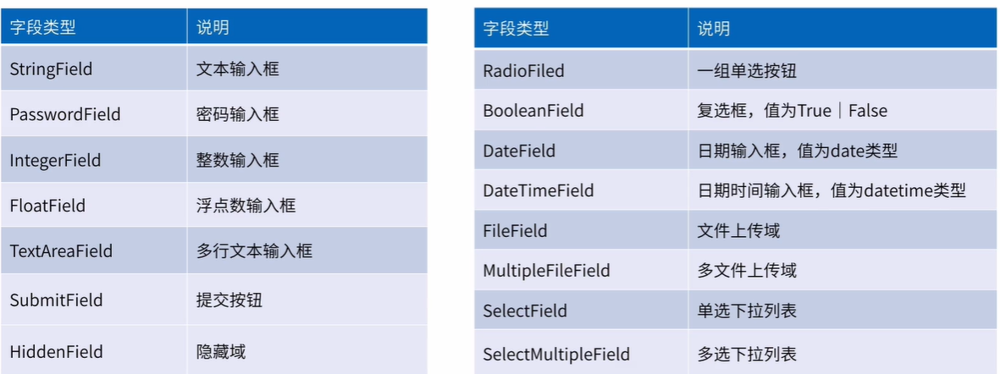
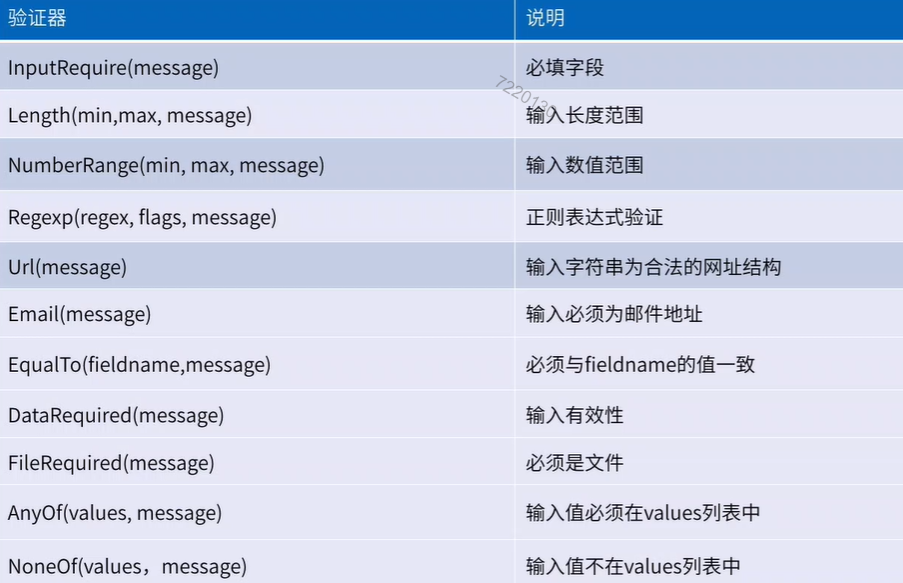

# flask作业总结

## 目录

  - [实现功能](#实现功能)
  - [flask-wtf插件](#flask-wtf插件)
    - [编写form表单](#编写form表单)
      - [form类型](#form类型)
      - [`render_kw`参数](#render_kw参数)
      - [`validators`参数](#validators参数)
    - [后端接受数据](#后端接受数据)
    - [前端发送数据](#前端发送数据)
  - [json和ajax](#json和ajax)
    - [Python的支持](#python的支持)
    - [Javascript的支持](#javascript的支持)
  - [`@wraps()`](#wraps)
  - [完成感想](#完成感想)

## 实现功能

可以同时多人登录，然后可以实现对话，也可以选择用户进行对话。

## flask-wtf插件

flask-wtf插件可以让flask获得更多表单的控制能力，在 `app.py`中的 [`login()`](app.py#16)和[`register()`](app.py#52)都有用到。

### 编写form表单

我将所有表单都编写到 [`libs.py`](libs.py#23)的表单类中，其中编写形式类似于：
```Python
password = PasswordField('password',validators=[DataRequired(message='You have to input password')])
submit = SubmitField('',render_kw={'value':'submit'})
```
前面的函数代表相应的form类型，参数中`validators`代表表单填写时的验证方法，`render_kw`为设置该表单的HTML属性。

#### form类型

类型有些多，直接贴图了：



#### `render_kw`参数

在 `render_kw`参数中可以对于HTML中用到的参数进行设置，我的页面设计也是一塌糊涂，所以用的不是很多，但是在有充分页面设计的时候在此处添加相关class、id可以对于form样式进行充分的设计，还是十分实用的。

#### `validators`参数

`validators`参数可以在前端限制用户的输入格式，具体的方式实际上用到的时候再细细查找也是可以的：



当然也可以自定义数据验证器，这部分因为没有用到也就不没有详细的了解。

要注意这只是前端对于输入的规范，并不能避免安全问题，所以在后端服务器也需要对于数据进行一些验证。

### 后端接受数据

在 [`app.py`](app.py#16) 中进行了表单数据的接受，其中

 - `form = loginForm()`对于表单对象进行了初始化
 - `if form.validate_on_submit():`会在后端对于数据进行验证
 - `username = form.data['username']`为接受数据的形式
 - `return render_template('login.html',message=message,form=form)`，最后一步是在渲染前端时传入form表单。

### 前端发送数据

[`login.html`](templates/login.html)中用到flask-wtf插件创建的form：

```HTML
<form action="" method="post">
	
		
			{{ field.label }}
			{{ field }} <br>
		
			{{ field }}
		
	
</form>
```

其中使用条件`if field.widget.input_type!="hidden"`是为了避免将hidden的token打印出来。

## json和ajax

因为前端只能向后端发送字符串，所以前后端经常使用的列表、字典等都无法进行传递，而json可以将其转换为字符串格式进行传输，很好的解决了这一问题。

### Python的支持

这里有专门的json模块进行json相关处理：
- `json.dumps()`将对象转换为字符串
- `json.loads()`将字符串转换为Python类型

在[`app.py`](app.py#78)的`chat`函数中对于json进行了简单应用，其中:
- `response = json.loads(request.data)`对前端数据转换为Python相关数据格式
- `return json.dumps(all_messages)`最后将python字典转换为字符串进行传递

在上面的应用中因为使用了ajax（无刷新提交），所以`return`中只提交了需要改变的数据值，不需要再对页面进行重新渲染。

### Javascript的支持

Javascript本身就不太熟悉，自己在[`chat.html`](templates/chat.html)中的应用显得十分勉强，在定时激活中不知道如何使用ajax（无刷新提交），于是很勉强的提交空数据来进行……

JSON对象的处理方法有：
- `JSON.stringify()`可以将JavaScript数据转换为字符串类型
- `JSON.parse()`可以将json字符串转换为JavaScript数据

JavaScript中进行传输使用到的是 `XMLHttpRequest`类，传输数据时使用方法：
```javascript
xhr.open("post","{{url_for('chat')}}",true)
xhr.send(data_sent)
```
其中 `open()`中 `true`代表异步提交。

xhr对象有readyState属性，该属性代表请求状态，具体有：
- 0：未初始化，尚未调用`open()`方法
- 1：已初始化，调用`open()`，但未调用`send()`
- 2：已发送`send()`且收到头信息
- 3：已经接收到部分相应主体信息
- 4：已经接收到所有响应数据，并且可以可以使用

在 [chat.html](templates/chat.html#32)中使用下面代码给`onreadystatechange`绑定一个处理事件：
```javascript
xhr.onreadystatechange = function(ev){
		if (this.readyState==4 && this.status==200){

		}
    }
```
上面条件语句表明当接收到全部响应数据且页面返回正常的时候执行条件语句内相关操作。

## `@wraps()`

对于细节部分还是没有很细的了解，但是通过[官方实例](https://docs.python.org/2/library/functools.html#functools.wraps)大概知道了相关的功能。

将试图[保护装饰器函数](libs.py#12)粘贴下来做解释：
```Python
def login_required(func):
    @wraps(func)
    def decorate_nest(*args,**kwargs):
        # user为设置的session参数
        if not 'user' in session:
            return redirect(url_for("login"))
        else:
            return func(*args,**kwargs)
    return decorate_nest
```
按照官方的解释思路，上面函数装饰func函数时，如果不使用 `@wraps(func)`时最后返回的会是`decorate_nest`函数而不是func原函数。

这样做的好处就是利用原函数的参数来进行某种操作，像上面实例中利用原函数对于是否登录进行判断。

## 完成感想

1. 完成作业之后明显感觉到看的时候感觉理解了但是实际做的时候很多东西都记不得了，随便举一例就是在json传输只能传字符串这一点，上课的时候讲到了，自己也记住了，但是在实际用的时候还是经常忘记，对于传字典、列表时常常忘记用json的解码、编码。所以说，**看了不等于会了，一定要练**，之前Javascript不熟悉也是因为这个原因吧。


2. 这次写的时候因为是第一次自己写，所以说写的也比较零碎，后面也没有进行代码的重构，主要是自己后面的课程落下来还要赶进度……

3. 写时没有想到的是如何实现私人对话对其他用户不可见，后来在和老师交流的时候告诉我可以在后端服务器中对于发送的消息进行过滤。我当时仅仅想的如何让数据传到前端后进行消息的屏蔽，没有去在后端服务器上做文章，老师一讲之后恍然大悟，感觉自己思路太局限了……