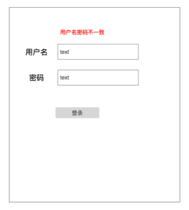
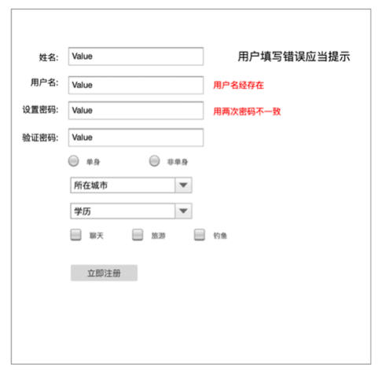
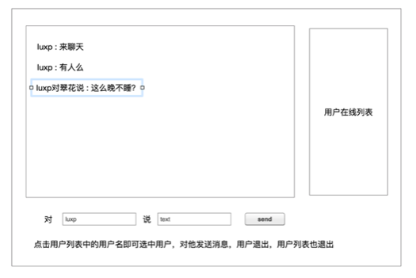

# 题目要求

1. 实现用户注册与登录，**发生错误必须有提示**

2. 只有登录的用户才能进入聊天室

3. 当用户退出登录就从聊天室退出

4. 用户发送消息与获得消息使用**ajax**

5. 可以选择对某个用户发送消息

6. 当用户进入聊天室或者退出聊天室，用户列表要随之变化

# 聊天室思路

## 1. 消息发送 

前端需要实现文本框输入，点击触发**ajax请求**

后端需要设计一张**聊天记录表**，包含消息发送人，接受人，消息内容，消息时间

视图函数接受消息并存入到数据表

## 2. 聊天消息显示

通过**定时器**，定时触发ajax请求后端读取聊天记录表数据

每次请求应该只请求上次请求过之后的数据，所以可以根据上次最后一条聊天id提取新消息

前端将新聊天信息添加到html节点中

## 3. 在线用户列表

设计一张用户在线表

用户每次登陆，会在在线表中记录

用户每次推出，会在在线线表中删除

前端定时拉取在线列表数据，显示用户列表

## 4. 私聊

当单击用户列表用户名时，应当*设定接受者*，随同聊天消息一起发送到后端

# 20200127 

## 审题

### HTML

需要的HTML比较简单，最复杂的应该是第三张图聊天页面，需要三个 div，这次需要注意的是开始的时候把应该要有的 id、class、name都设置好，不要后面需要调整样式的时候才开始弄。

假如后面用到flask-wtf插件的话，前端很多关于表单的代码都要删除，但是为了样式的确定，还是先用前端写好表单定义样式，之后具体使用时再修改。

### Flask

概括后端需要完成的任务：
- [ ] 登录的检测
- [ ] 注册信息检测、提交数据库
- [ ] 聊天界面在线用户列表的维持
- [ ] 聊天界面在线用户的定期更新
- [ ] 聊天页面聊天内容队列的维持
- [ ] 聊天页面聊天内容的定期更新

数据库主要需要维护的是用户数据，聊天内容的显示现在没有思路。先设计页面然后实现登录注册，然后再考虑聊天内容显示。